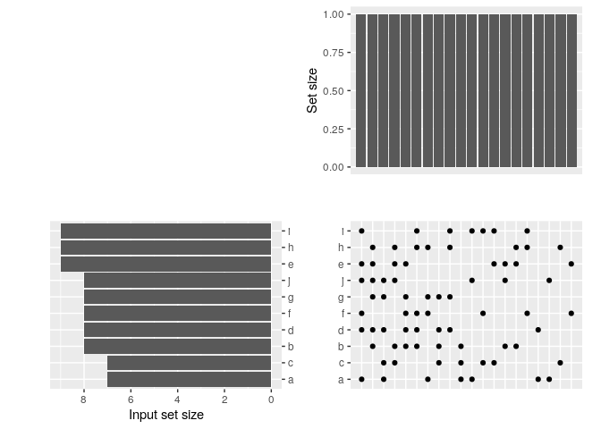
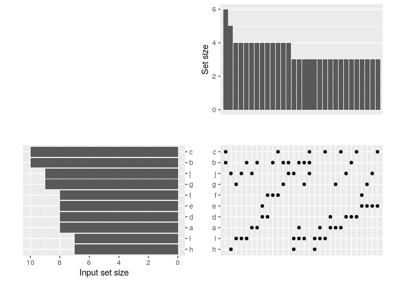

<!-- README.md is generated from README.Rmd. Please edit that file -->

agitated
========

<!-- badges: start -->

<!-- badges: end -->

An UpSetR clone to soothe my agitated heart

Installation
------------

You can install the released version of agitated from github with

    devtools::install_github("Alanocallaghan/agitated")

Example
-------

This is a basic example which shows you how to solve a common problem:

    library("here")
    #> here() starts at /home/alan/Documents/github/agitated
    library("devtools")
    #> Loading required package: usethis
    load_all(here())
    #> Loading agitated
    #> 
    #> Attaching package: 'testthat'
    #> The following object is masked from 'package:devtools':
    #> 
    #>     test_file
    library("agitated")
    ## exclusive intersections
    agitated(example_data())
    #> Warning: `expand_scale()` is deprecated; use `expansion()` instead.

    #> Warning: `expand_scale()` is deprecated; use `expansion()` instead.

    ## exclusive intersections, higher limit on number of sets (default is 20)
    agitated(example_data(), exclusive = FALSE, nsets = 30)
    #> Warning: `expand_scale()` is deprecated; use `expansion()` instead.

    #> Warning: `expand_scale()` is deprecated; use `expansion()` instead.

